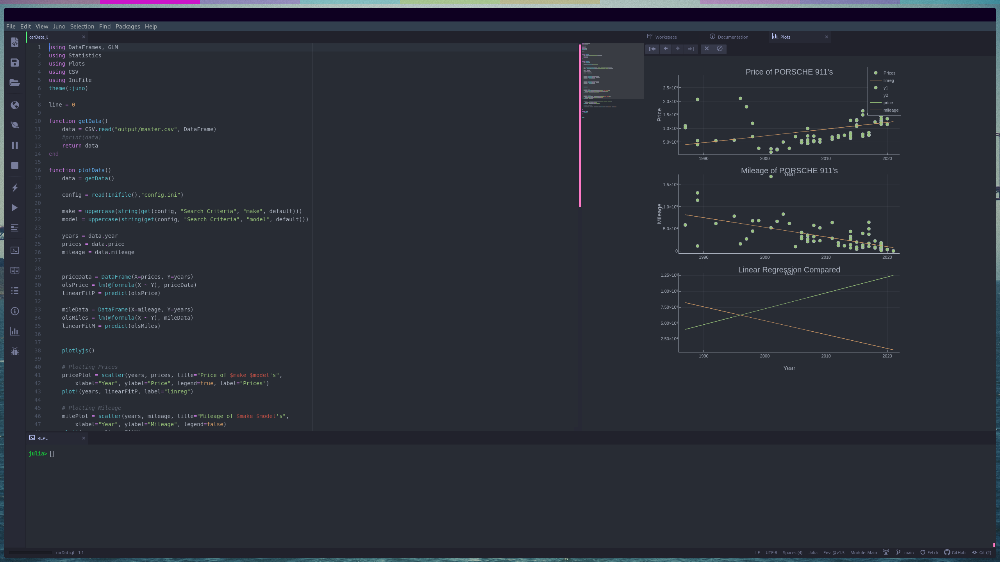
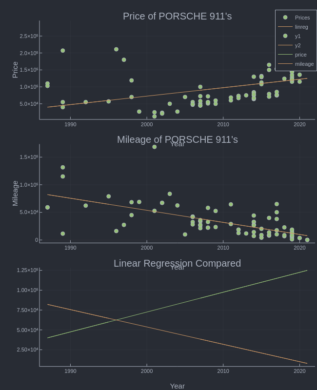

# cardata
Program for finding used cars across various sites and calculating price and mileage data.

## Project Overview
***

The collection of programs work in unison in order to scrape used car sites, report the listing to the user, and calculate useful data such as price-related statistics. The following sites will be scraped:

- [CarGurus](https://www.cargurus.com/)
- [Autotrader](https://www.autotrader.com/)
- [Cars.com](https://www.cars.com/)
- [TrueCar](https://www.truecar.com/)
- [Edmunds](https://www.edmunds.com/)
- [CarsDirect](https://www.carsdirect.com/)

### Requirements
***

A number of these libraries and packages will likely come installed on most systems, but in order to ensure that you have all of them, it is easiest to try and install all of these.

Python libraries can be easily installed by using pip, so just paste the code below into your terminal:

```pip3 install BeautifulSoup4 lxml requests selenium more-itertools```

Julia packages require an extra step, and cannot be added as a sum like Python libraries can. You must be in the Julia REPL to perform the following:

```using Pkg```
then,
```Pkg.add("[PackageName]")```

The library and package names are included in the list below in the parentheses, and they are case-sensitive!


- [Julia](https://www.julialang.org)
  - [Plots](http://docs.juliaplots.org/latest/) (Plots)
  - [PlotlyJS](https://juliapackages.com/p/plotlyjs) (PlotlyJS)
  - [GLM](https://juliapackages.com/p/glm) (GLM)
  - [DataFrames](https://juliapackages.com/p/dataframes) (DataFrames)
  - [CSV](https://juliapackages.com/p/csv) (CSV)
  - [IniFile](https://juliapackages.com/p/inifile) (IniFile)
- [GeckoDriver](https://github.com/mozilla/geckodriver/releases)

The pip code above installs all of these libraries, but they are listed here for documentation's sake:
- [Python](https://www.python.org)
  - [BeatifulSoup](https://beautiful-soup-4.readthedocs.io/en/latest/) (BeautifulSoup4)
  - [lxml](https://lxml.de/) (lxml)
  - [requests](https://requests.readthedocs.io/en/master/) (requests)
  - [selenium](https://pythonspot.com/selenium/) (selenium)
  - [more-itertools](https://pypi.org/project/more-itertools/) (more-itertools)

### Usage
***

This tool requires two programs to be run; one to scrape used car sites, and another to interpret and plot the data. In order to run the scraping program, you should run it like any other python program, meaning navigate to the program's location (folder) through your terminal by using cd (change directory), and then typing ```python3 scraper.py```

Once you do this, you will be prompted to enter a make, model, city, and state. Once you have done that, the scraping process will begin! The terminal will update you as it works through sites, but keep in mind that more popular cars will take longer to scrape as there are more of them.

After the program has finished running, you should then find your way to whichever IDE you use to run Julia. You do not always need an IDE to use Julia, but for the plots that we will be using to render it is easiest this way. The uber-juno package on Atom is generally the most robust one, but VSCode also offers a popular package. Once you have the program pulled up in your IDE, simply run it and you should see the plots!

Below are examples of this process:




